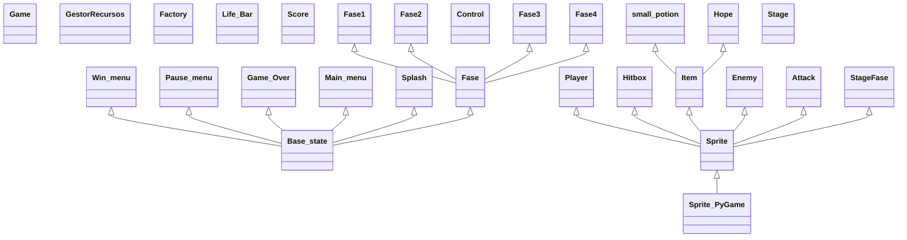

# Diagrama UML

```mermaid
---
title:
---
classDiagram
    class Game 
    class GestorRecursos 
    class Factory 


    class Life_Bar
    class Score
    class Player
    class Hitbox
    class Item
    class small_potion
    class Hope
    class Control
    class Enemy 
    class Attack  


    class Win_menu
    class Pause_menu
    class Game_Over
    class Main_menu
    class Splash


    class Base_state
    class Fase
    class Fase1
    class Fase2
    class Fase3
    class Fase4
    class Sprite
    class Stage


    Sprite <|-- Sprite_PyGame

    Player <|-- Sprite
    Hitbox <|-- Sprite
    Item <|-- Sprite
    small_potion <|-- Item
    Hope <|-- Item
    Enemy <|-- Sprite
    Attack <|-- Sprite

    Win_menu <|-- Base_state
    Pause_menu <|-- Base_state
    Game_Over <|-- Base_state
    Main_menu <|-- Base_state
    Splash <|-- Base_state

    Fase <|-- Base_state
    Fase1 <|-- Fase
    Fase2 <|-- Fase
    Fase3 <|-- Fase
    Fase4 <|-- Fase

    StageFase <|-- Sprite
    


```